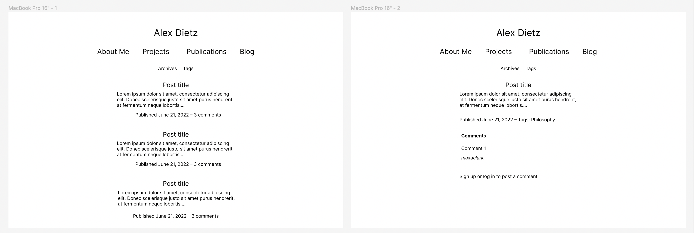
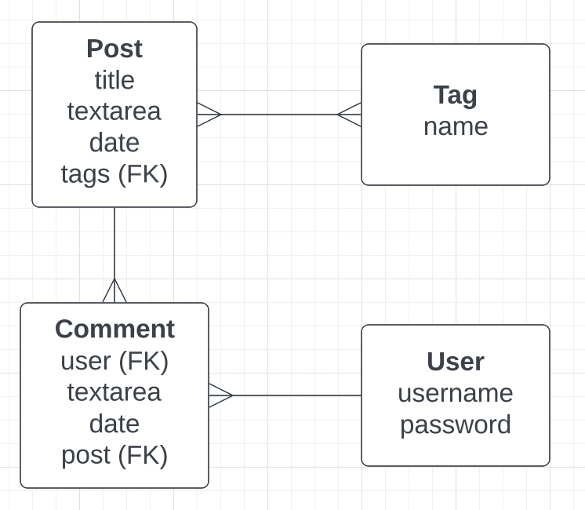
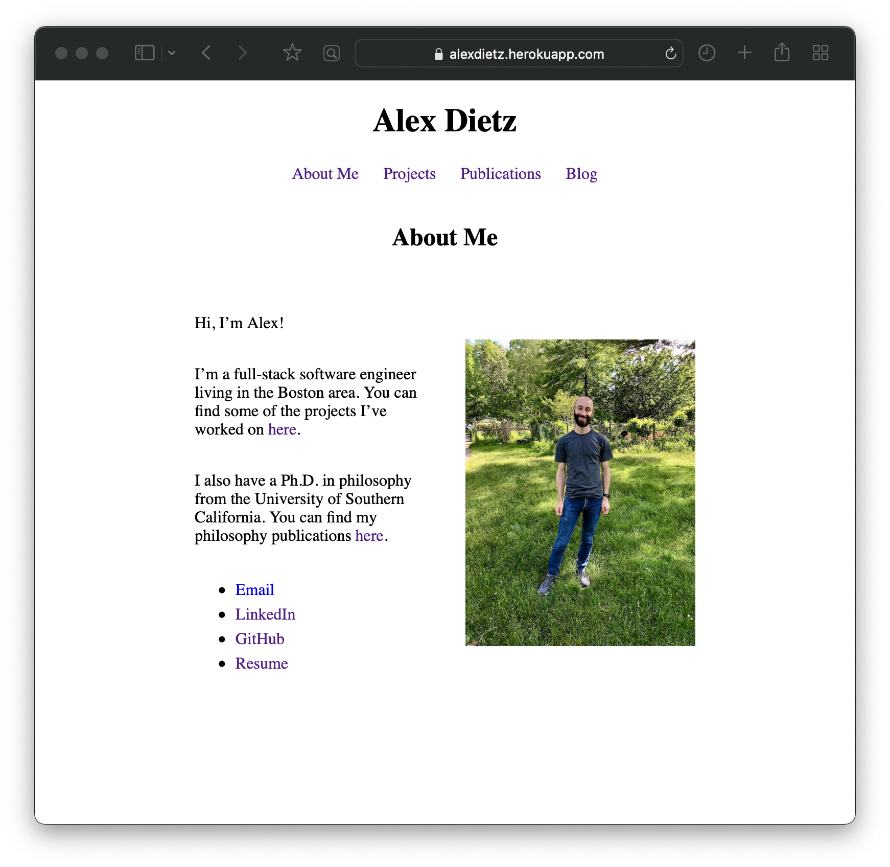
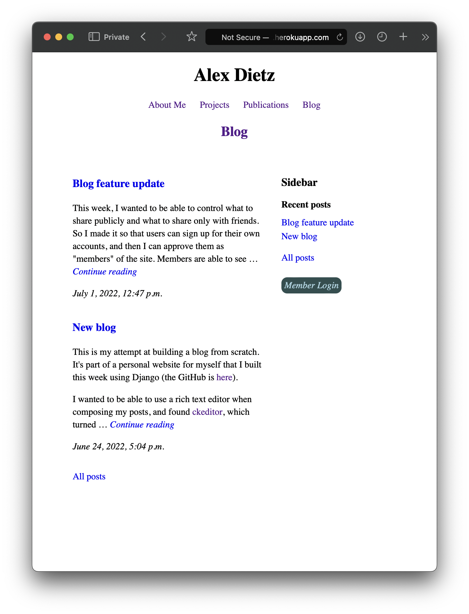

# Personal Website

## Project Description
This is a personal website for myself, including a portfolio of my coding work and philosophy publications, and a blog. It's built in Django.

## Wireframes

## ERD

## Screenshots

## Development Roadmap
- [x] User accounts
- [x] Comments on blog posts
- [x] Filter post access depending on user status
- [ ] Archives page
- [ ] Rich text comments